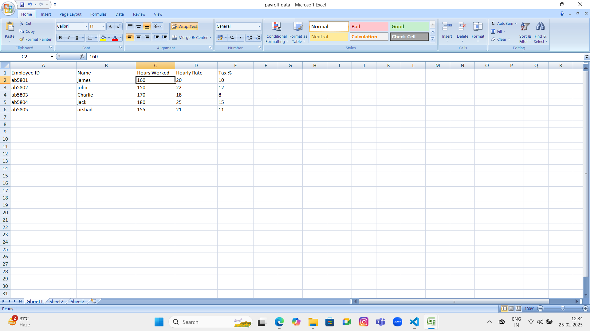
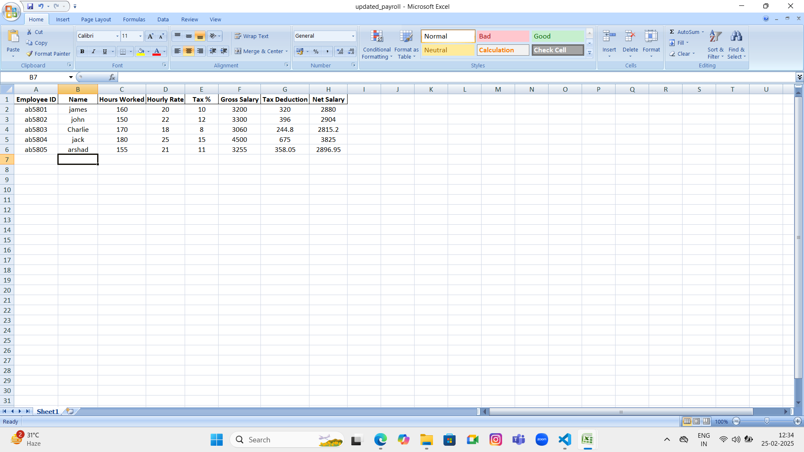
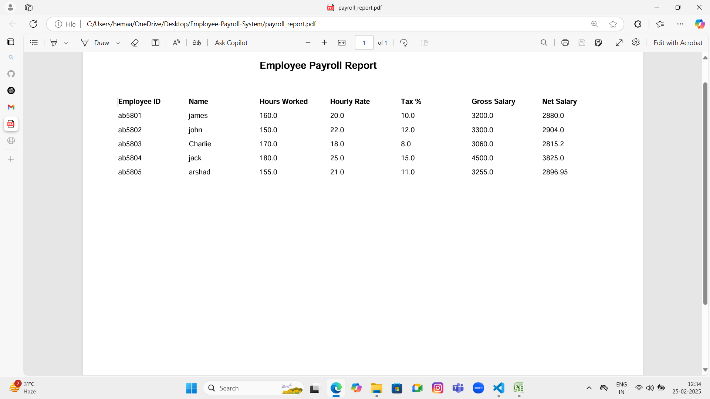

# 🏢 Employee Payroll Management System (Excel + Python Automation)

## 🚀 Overview
This is an automated **Employee Payroll Management System** that reads payroll data from an Excel file, processes the salary details, and generates a detailed payroll report in **PDF format** using Python.

## 🛠 Technologies Used
- **Python** (Pandas, ReportLab)  
- **Excel** (Data Input)  
- **Git & GitHub** (Version Control)  

## ✨ Features
✔ Reads employee payroll data from an Excel file  
✔ Performs payroll calculations and updates the sheet  
✔ Generates a formatted **Payroll Report (PDF)** automatically  

## 📂 Project Structure
## 📸 Screenshots  

### 📊 Payroll Data (Excel Input)  
  

### 📈 Updated Payroll (Excel Output)  
  

### 📝 Payroll Report (PDF Output)  
  

